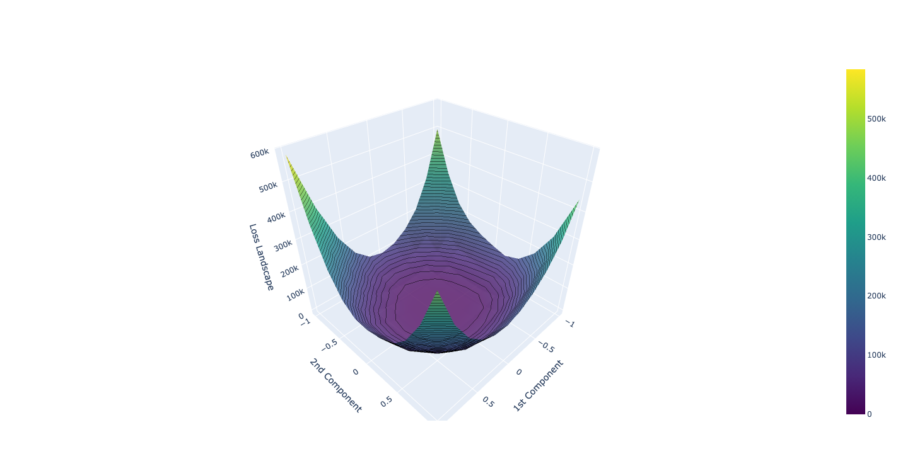

<div align="center">

<h1> Visualizing Torch Landscape


_________________________
</div>


# Installation
```bash
# 1. Create new environment for the the project:
conda create -n pyq python=3.10
# 2. Activate the new environment:
conda activate py310
# 3. Install cudatoolkit 11.3 and PyTorch dependencies:
conda install pytorch cudatoolkit=11.3 -c pytorch
# 4. Clone Visualizing Torch Landscape repository:
git clone https://github.com/SamirMoustafa/visualization-loss-landscape-GNNs.git && cd visualization-loss-landscape-GNNs
# 5. Install visualization loss landscape GNNs:
pip install -e .
```

# Get Started
```python
from torch_landscape.directions import LearnableDirections, PcaDirections
from torch_landscape.landscape_linear import LinearLandscapeCalculator
from torch_landscape.trajectory import TrajectoryCalculator
from torch_landscape.utils import clone_parameters
from torch_landscape.visualize import VisualizationData, Plotly2dVisualization
from torch_landscape.visualize_options import VisualizationOptions


# Define the model and the training loop
# For each step in the training loop
    intermediate_results.append(clone_parameters(model.parameters()))
...
...
...
# Define evaluation function that has arguments ONLY two model, and iterative data.
# Example
def evaluate_func(model, test_loader):
    device = [*model.parameters()][0].device
    model.eval()
    test_loss = 0
    with no_grad():
        for data, target in test_loader:
            data, target = data.to(device), target.to(device)
            output = model(data)
            test_loss += nll_loss(output, target, reduction="sum").item()
    test_loss /= len(test_loader.dataset)
    return test_loss

file_path = "./my_landscape_surface"
options = VisualizationOptions(num_points=10)
trajectory = TrajectoryCalculator(optimized_parameters, (b1, b2)).project_disregard_z(intermediate_parameters)
trajectory.set_range_to_fit_trajectory(options)
landscape_calculator = LinearLandscapeCalculator(optimized_parameters, (b1, b2), options=options)
landscape = landscape_calculator.calculate_loss_surface_data_model(model, lambda: evaluate_func(model, data))
Plotly2dVisualization(VisualizationOptions()).plot(VisualizationData(landscape, trajectory),
                                                   file_path,
                                                   file_extension="pdf")

```


